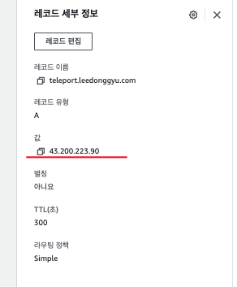
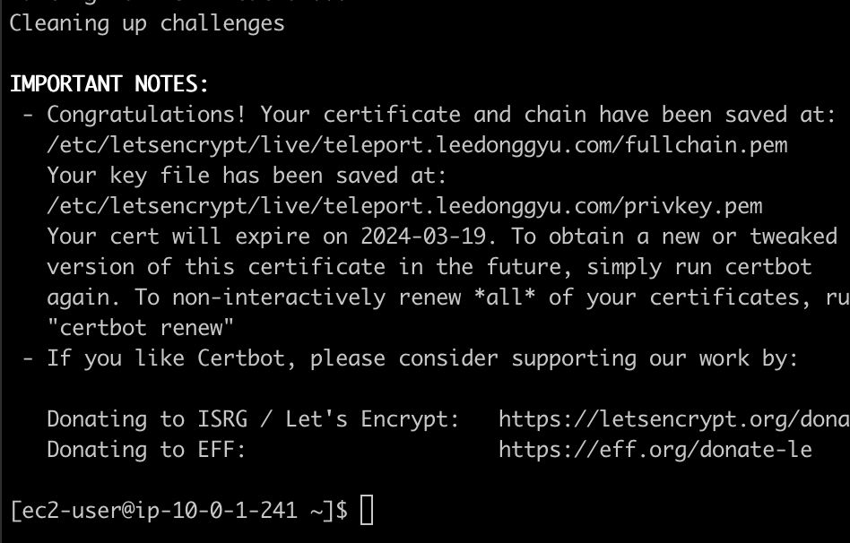
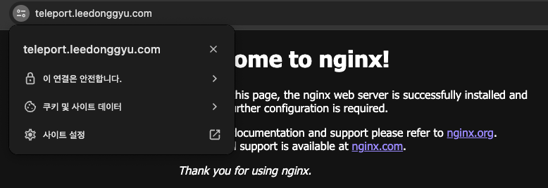
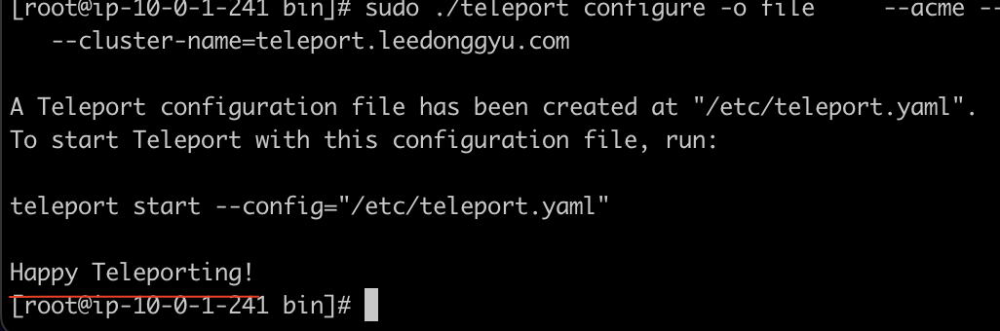
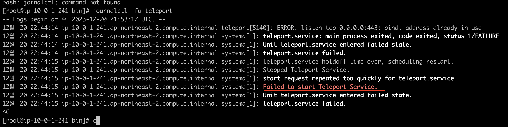

# Teleport 설치


## 1. Route53 설정



- route53과 Teleport가 설치될 인스턴스의 EIP를 등록시킨다.

## 2. Install Teleport

```sh
    ## teleport 설치
    curl https://goteleport.com/static/install.sh | bash -s 14.2.3

    ## nginx 설치 (nginx 하지마셈)
    # sudo systemctl install nginx
```

## 3. Let's Encrypt 설정

```sh

    ## certbot은 Extras 패키지이기 때문에, EPEL Repository를 활성화 한다.
    sudo yum install epel-release -y

    ## if amazon-linux 2
    ## sudo amazon-linux-extras install epel -y

    yum reposlit | grep epel

    ## cert-bot 설치 (apache)
    sudo yum install certbot python2-certbot-apache -y

    ## cert-bot 설치 (nginx)
    sudo yum install certbot python2-certbot-nginx -y

    ## 인증서 발급
    sudo certbot --standalone -d [domain-name] certonly

    ## Letsencrypt 위치 (sudo -i)
    cd /etc/letsencrypt/live
```



## 4. nginx https 설정 (안해도 됨)



```sh
    // sudo vi /etc/nginx/nginx.conf

    server {
        listen       80;
        listen       [::]:80;
        server_name  _;
        root         /usr/share/nginx/html;

        listen 443 ssl; ## Managed by Certbot (Added)

        # RSA Certificate (Added)
        ssl_certificate /etc/letsencrypt/live/teleport.leedonggyu.com/fullchain.pem;
        ssl_certificate_key /etc/letsencrypt/live/teleport.leedonggyu.com/privkey.pem;

        # Added
        if ($scheme != "https") {
                return 301 https://$host$request_uri;
        }

        ## ...
    }
```

## 5. Teleport cluster 설정



```sh
    ## acme-email : ACME 인증서 발급 및 관리와 관련된 알림 / 경고를 받을 이메일
    ## cluster-name : domain (SSL)
    sudo teleport configure -o file \
    --acme --acme-email=zkfmapf123@naver.com \
    --cluster-name=teleport.leedonggyu.com

    ## teleport 시작
    sudo systemctl enable teleport
    sudo systemctl start teleport
```

## etc. 어라.. Teleport가 안되네...



- 443을 이미쓰고있다..
- nginx에 443을 연결하고 있어서 그런가보다.. 괜히설정 했네
- nginx - teleport proxy를 해주는거라고 착각했음 (nginx 지우자)

## Issue

> "teleport" not found

```sh

    ## cd /etc/local/bin 에 보면 telport가 있다.
    sudo ./telport ...
```

## Reference

- <a href="https://blog.jiniworld.me/137"> 인증서 발급 </a>
