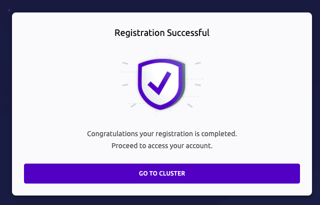

# Management Teleport

## 1. Teleport admin user 추가


```sh
    ## admin 유저 추가
    ## admin 유저로 로그인하면 인스턴스의 로그인자체를 (root, ec2-user, ubuntu) 로 진행할수 있게함
    sudo tctl users add admin --roles=editor,access --logins=root,ec2-user,ubuntu

    ## 그 이후 password 설정하라는 URL을 던져준다.
```

## 2. 비밀번호 등록 (차례대로 진행)





- 현재 Teleport 설치되어있는 인스턴스가 등록이 되어있다.

## 3. Teleport 야무진 기능

> Session Recording


## 3. 그럼 WAS Instance를 등록해보자

- 지금 난 Webserver tier에 teleport-instance가 설치되어 있고,
- Was tier 에 그냥 Instance가 하나 띄워져 있다.
- db tier 에 RDS도 있음...
- Teleport로 접근을 해보자...

## 4. WAS tier에 인스턴스 등록


- Add Resource -> Amazon-linux2로 선택해서 진행한다.
- 다만 해당 WAS tier instance에는 직접접근해서 해당명령어를 진행했다. (user_data로 해도 될듯)
- 그러면 끝... (의외로 간단하네...)

## 5. DB tier에 db 등록

- ...todo
